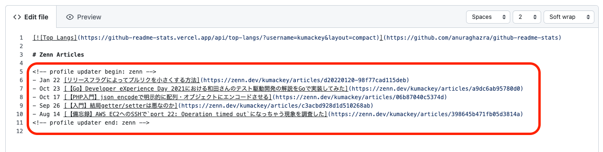
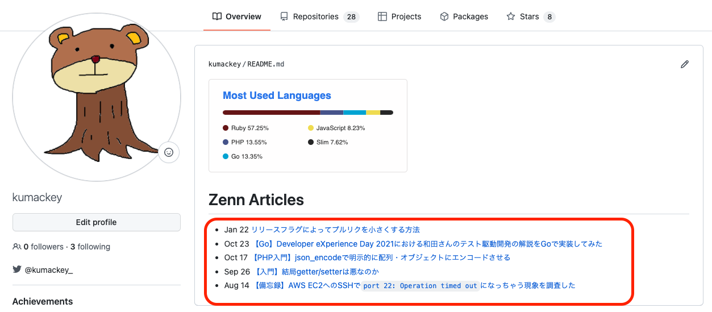

# Profile Updater

Zennの記事のリストを取得し、プロフィールを更新します。

# Get Started

前提: [プロフィールの README を管理する - GitHub Docs](https://docs.github.com/ja/account-and-profile/setting-up-and-managing-your-github-profile/customizing-your-profile/managing-your-profile-readme)

`.github/workflows/`に以下のようなYAMLファイルを置きます。
`zenn_user_id`には自分のZennのユーザIDを入れてください。

```yaml:.github/workflows/profile.yml
name: profile updater

on: [ workflow_dispatch ]

jobs:
  profile-updater:
    runs-on: ubuntu-latest
    steps:
      - uses: actions/checkout@v2
      - uses: kumackey/profile-updater@v1
        with:
          zenn_user_id: kumackey
      - name: Commit and push
        run: |
          git config --local user.name "GitHub Actions"
          git config --local user.email "action@github.com"
          git add .
          git commit -m "profile updated"
          git push origin main
```

`README.md`内でZennの記事のリストを置きたい箇所に、以下記述を入れてください。

```text:README.md
<!-- profile updater begin: zenn -->
<!-- profile updater end: zenn -->
```

該当アクションを手動実行することで、リストを取得し更新できます。




# How to use

## withのパラメータ

| パラメータ名            | 必須か | 説明              |
|-------------------|-----|-----------------|
| `zenn_user_id`      | YES | ZennのユーザID      |
| `zenn_max_articles` | NO  | Zennの表示したい最大記事数 |