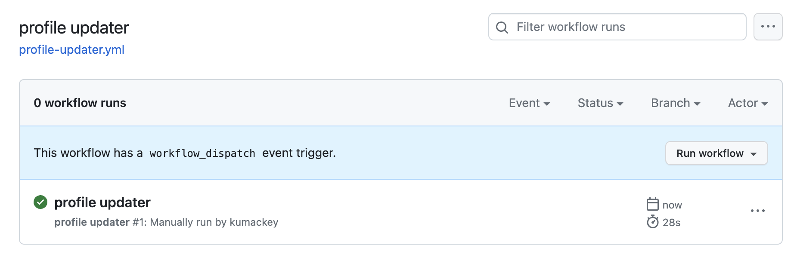

# Get Started

一番需要があると思われる、Qittaの記事リストをREADME.mdに表示する方法を説明します。

## README.mdの作成

[プロフィールの README を管理する](https://docs.github.com/ja/account-and-profile/setting-up-and-managing-your-github-profile/customizing-your-profile/managing-your-profile-readme#adding-a-profile-readme)を参考に、プロフィール用リポジトリに`README.md`を作成してください。
要はusername/usernameのリポジトリを作って、`README.md`を作成しておくだけです。
`README.md`内で記事リストを表示したい場所に以下記述を入れてください。

```text:README.md
# Qiita Articles

<!-- profile updater begin: qiita -->
(ここにリストが表示されます。この記述は後で更新され消えます)
<!-- profile updater end: qiita -->
```

## GitHub Actionsの設定

`.github/workflows/`に以下のようなYAMLファイルを置きます。ファイル名は何でも良いですが、ここでは`profile-updater.yml`としておきます。

```yaml:.github/workflows/profile-updater.yml
name: profile updater

on:
  schedule:
    - cron: '0 0 * * *'
  workflow_dispatch:

jobs:
  profile-updater:
    runs-on: ubuntu-latest
    steps:
      - uses: actions/checkout@v4
      - uses: kumackey/profile-updater@v1
        with:
          qiita_user_id: <ここに自分のQiitaのUser IDを入力してください>
      - name: Commit and push
        run: |
          git config --local user.name "GitHub Actions"
          git config --local user.email "action@github.com"
          git commit -am "profile updated" || true
          git push origin main
```


## GitHub Actionsの実行


以下のように緑マークの表示がされれば成功です。


`README.md`を確認すると、Qiitaの記事リストが表示されているはずです。


ちなみに、以下で記述した設定により「1日1回Github Actionsを実行する」という仕組みになっているので、今後は手動でGitHub Actionsの実行をする必要はありません。
```
  schedule:
    - cron: '0 0 * * *'
```
